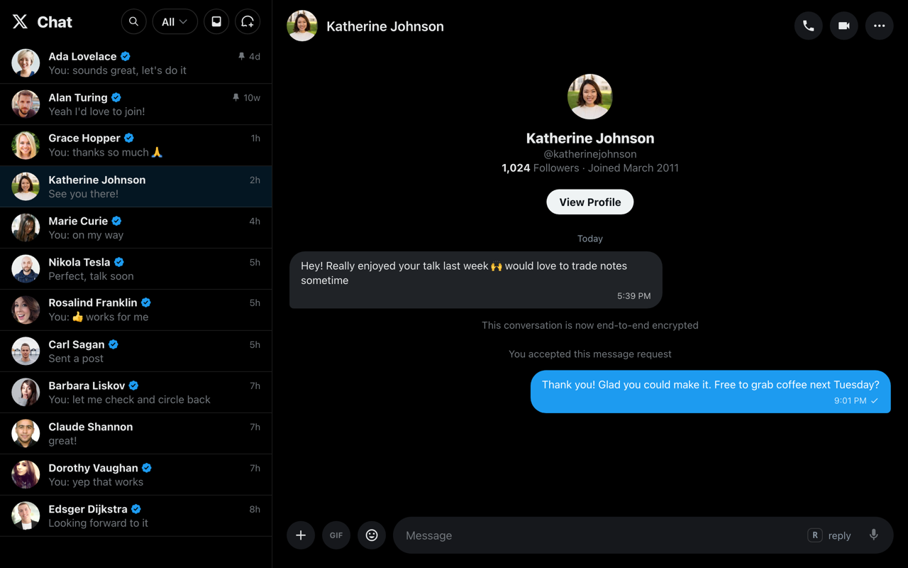

# xChat

<p align="center">
  
</p>

A fast, full-screen, **keyboard-first layer on top of X (Twitter) Direct Messages** — inspired
by Superhuman and the [Inflow](https://github.com/grinich/inflow) LinkedIn client.

- **In-page Chrome extension** — it never touches X's API or crypto. X does all the fetching,
  decryption, realtime, and sending.
- **Full-screen reskin** of X's DM interface — instant view switches, no entrance animations.
- **Keyboard navigation** — `j`/`k` to move between conversations, reply-on-`r`, `Tab` to
  cycle inbox filters, `p` to pin/unpin.
- **Message-request triage** — `q` opens requests, `j`/`k` browses them, `Enter` accepts and
  drops you straight into the reply box, `Esc` backs out.
- **Command palette** (`⌘K`) and **quick-switcher** (`⌘J`).
- **Quick search** across your conversations.
- **Discoverable shortcuts** — small keycap hints on the buttons themselves (`/`, `tab`, `Q`,
  `C`, `enter`, `esc`), so you learn the keys as you click.
- **Toolbar button** that jumps straight to your DMs.
- **Experimental: agent-scriptable via [WebMCP](https://webmachinelearning.github.io/webmcp/)** —
  AI agents like Claude can list, read, search, and reply to your DMs through typed tools
  instead of screen-scraping ([details below](#ai-agents--webmcp-experimental)).
- Because it rides X's own client, **every conversation works — including
  end-to-end-encrypted XChat threads.**

Everything maps to real X DM functionality — nothing is faked. X DMs have no archive / star /
snooze, so xChat doesn't pretend to.

> Unofficial and not affiliated with, endorsed by, or sponsored by X Corp. "X" and "Twitter"
> are trademarks of their respective owners.

## Develop

```bash
npm install       # postinstall runs `wxt prepare`
npm run dev        # WXT dev build with HMR → dist/
npm run build      # production build → dist/
npm test           # unit tests (vitest)
npm run compile    # typecheck (tsc --noEmit)
```

## Load in Chrome (one-time)

The extension can't self-install (Chrome requires a manual step), so:

1. `npm run build`
2. Open `chrome://extensions`
3. Toggle **Developer mode** on (top-right)
4. Click **Load unpacked** and select the **`dist`** folder
5. Open <https://x.com/messages> (or `x.com/i/chat`). xChat activates automatically.

To pick up code changes: `npm run build` again, then click the refresh icon on the xChat card
in `chrome://extensions` and reload the X tab. (`npm run dev` auto-rebuilds.)

## Keyboard shortcuts

| Key | Action |
|---|---|
| `j` / `k` (↓/↑) | Move to next / previous conversation **and open it** |
| `Enter` / `o` | Open selected conversation · `Enter` accepts an open message request |
| `r` | Reply — focus the composer (moving never auto-focuses it) |
| `⌘K` / `Ctrl+K` | Command palette |
| `⌘J` / `Ctrl+J` | Quick switcher (fuzzy jump) |
| `/` | Search |
| `c` | New chat |
| `Enter` | Send (in composer) · `Shift+Enter` newline |
| `Tab` / `⇧Tab` | Cycle inbox filter (All / Unread / Direct / Groups) |
| `q` | Message requests (`Esc` goes back) |
| `p` | Pin / unpin the selected conversation |
| `g g` / `G` | Top / bottom of list |
| `?` | Command palette (help) |

Every shortcut maps to real X DM functionality — nothing is faked. (X DMs have no
archive/star/snooze, so xChat doesn't pretend to; features that would silently no-op were
removed.)

## AI agents & WebMCP (experimental)

xChat registers [WebMCP](https://webmachinelearning.github.io/webmcp/) tools on x.com
(`document.modelContext`, via [`@mcp-b/global`](https://www.npmjs.com/package/@mcp-b/global)),
so an AI agent can drive your DMs through typed tool calls instead of screen-scraping —
list conversations, read a thread, search, open, draft, send, pin, triage requests. The
tools wrap the same DOM layer as the keyboard shortcuts: X's own client still does all
fetching/crypto/sending, so E2E-encrypted threads work like any other.

WebMCP is an emerging W3C proposal (Chrome support is in origin trial), so consider this
whole surface **experimental** — the tool layer works today, but the standard and the
ways agents connect to it are still moving.

### How it works

X never sees an API call. A MAIN-world content script registers the tools on the page;
each tool reads the rendered DOM or drives X's own controls (the same `selectors.ts` /
`actions.ts` used by the keyboard layer). For agents outside the browser, the optional
`xchat-mcp` bridge relays MCP over a localhost-only WebSocket:

```
Claude Code / any MCP client
   │  stdio (MCP)
xchat-mcp  (bridge/ — localhost-only WebSocket server, no credentials, no X access)
   ▲  ws://127.0.0.1:9553 (extension dials OUT; nothing listens in the browser)
xChat background worker
   ▲  runtime Port
content-script relay
   ▲  postMessage
MAIN-world WebMCP tools  →  X's rendered DOM & controls
```

Everything between your MCP client and the page is a dumb pipe: tool calls and results
pass through verbatim, the bridge holds no state, and when it isn't running the extension
does nothing but one quiet localhost dial with backoff. In-browser agents that speak
WebMCP natively (or via bridges like [MCP-B](https://mcp-b.ai)) can skip the bridge
entirely and use the page tools directly.

| Tool | What it does |
|---|---|
| `xchat_state` | Where am I: view, open conversation, unread count |
| `xchat_list_conversations` | Rendered inbox/requests rows (id, title, snippet) |
| `xchat_search_conversations` | Fuzzy-search the rendered rows |
| `xchat_open_conversation` | Open a thread (SPA navigation) |
| `xchat_read_messages` | Read a thread's messages (sender + time inferred) |
| `xchat_draft_reply` | Fill the composer without sending (leaves the thread open for review) |
| `xchat_send_message` | Fill the composer and send — works from any x.com page |
| `xchat_set_inbox_filter` | All / Unread / Direct / Groups |
| `xchat_toggle_pin` | Pin/unpin via X's own context menu |
| `xchat_open_requests` / `xchat_close_requests` / `xchat_accept_request` | Message-request triage |

**Sending is verified, never assumed.** `xchat_send_message` reports success
(`sent: "confirmed"`) only after X clears the composer **and** the sent bubble actually
appears in the thread; anything else is an explicit error stating the text was left as an
unsent draft. It re-asserts the text before every submit attempt (X's async draft-restore
can otherwise swap the content), and escalates through several submit mechanisms because
no single one reliably triggers X's send handler. If the tab isn't on the DM view, the
tool opens the thread, sends, and returns the tab to where it was — behind a brief visual
shield, so the page never visibly changes.

One caveat by design: the tools drive your **real** browser tab. Sends round-trip
invisibly, but reads/opens genuinely navigate — agent calls made while you're actively
browsing x.com in that tab can interfere in both directions.

### Connect a local MCP client (optional bridge)

xChat ships its own tiny bridge — [`bridge/`](./bridge) (`xchat-mcp`), a stdio MCP server
that the extension connects out to over a localhost-only WebSocket. No extra browser
extensions, no third-party relays:

```bash
cd bridge && npm install && npm run build
claude mcp add --scope user xchat -- node /absolute/path/to/xchat/bridge/dist/cli.js
```

Open an x.com tab in Chrome (with xChat installed) and the `xchat_*` tools appear in
Claude Code — "read my unread DMs and draft replies" just works. If the tools are
missing, call `xchat_bridge_status` to see why (usually: no x.com tab open). One gotcha:
after updating/reloading the extension, reload any open x.com tabs too — extension
reloads orphan the content scripts that relay to the bridge.

You can also poke the tools directly from DevTools on x.com, no bridge required:

```js
navigator.modelContextTesting.listTools()
await navigator.modelContextTesting.executeTool('xchat_state', '{}')
```

## How it holds up when X changes its UI

Every DOM hook lives in one file — [`src/content/selectors.ts`](./src/content/selectors.ts) —
and is anchored to `data-testid`/`role`, never to hashed class names. On boot, a self-check
verifies the required hooks exist and shows a small toast if X's markup has drifted, degrading
gracefully instead of breaking the page. The full-screen reskin is pure CSS injected via the
manifest, so it auto-applies across X's React re-renders with no JS.
